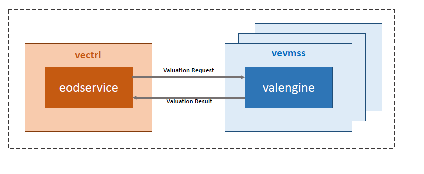
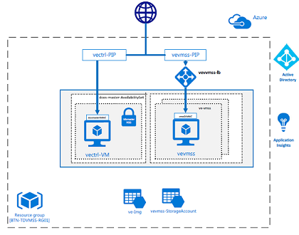

# compute-engine-vmss

A simple client-server version of the [mock compute engine](https://github.com/amolthacker/azure-poc-compute-engine-mock) application 
written in Go. `eodservice` simulates the client that submits valuation requests to a grid of remote compute engine (server) 
instances `valengine`. The application uses the [Kite](https://github.com/koding/kite) micro-services framework for RPC. 
The `valengine` responds to requests by doing static pricing compute using the [mock compute engine](https://github.com/amolthacker/azure-poc-compute-engine-mock)

The `valengine(s)` run in Azure VM Scale Sets wherein each instance of the `valengine` process runs on a dedicated VM 
instance of the VMSS and is configured for schedule driven and resource (CPU) utilization driven horizontal autoscaling 

## Architecture





## Provisioning

```
See deploy/az-provision.sh
```

## Operations

Submit jobs from Ctrl within AZ

```
$ ssh -i ~/.ssh/az veritas@vectrl.eastus.cloudapp.azure.com
[veritas@ve-ql-ctrl ~]$ submit-compute-batch -n 10 -s vevmss.eastus.cloudapp.azure.com
[veritas@ve-ql-ctrl ~]$ tail -f /var/log/veritas/eodservice.log
```

Check job logs from VMs in VMSS

```
$ ssh -i ~/.ssh/az -p 22001 veritas@vevmss.eastus.cloudapp.azure.com
[veritas@vevmssok5000001 ~]$ tail -f /var/log/veritas/valengine.log
```
